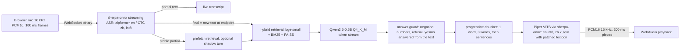

# VORA

Streaming voice question answering on CPU: speech in, spoken answer out, in English and Mandarin. Free, open-source models only (ASR ≤50 MB, TTS ≤30 MB, LLM ≤1B parameters), answering from a local knowledge base, with every result checked against public speech recorded by real people.

Technical report (3 pages): [`docs/report.pdf`](docs/report.pdf) · full detail: [`docs/appendix.md`](docs/appendix.md)

## Demo

- **Local (best latency):** see Quickstart, then open `http://localhost:8000`, press Start and ask "How long is the warranty on the VORA X200?" or "怎么恢复出厂设置".
- **No microphone:** use the "Sample question" menu. "Real callers" are public MInDS-14 phone recordings of bank questions; they are off-topic for this knowledge base, so they show real-voice speech recognition and the "not sure" refusal.
- **Hosted demo (AWS, 2 vCPU):** private link of the form `https://<IP>/#key=…`, generated in AWS CloudShell (`cat ~/vora-demo-link.txt`). About 4–6 s per answer on that box. Script: [`docs/demo-script.md`](docs/demo-script.md).

## Results at a glance

Final run 2026-10-06, Apple M2 (8 cores, CPU only), quiet host, test splits read once. Generated in `results/gates_final.json` by `scripts/report_gates.py`.

| Gate | Target | Result | Measured |
|---|---|---|---|
| G1 latency, synthetic en audio | p50 ≤1500, p90 ≤1800 ms | PASS | p50 1006 / p90 1438 ms |
| G1r latency, real voices (MInDS-14) | answered p50 ≤1500, p90 ≤1800 ms | PASS | p90 en-US 1337, en-GB 1422, en-AU 1725, zh 1507 ms |
| G2 TTS first chunk | p95 ≤200 ms | PASS | en 70 / zh 89 ms |
| G3 ASR+RAG+TTS memory | ≤500 MB USS | PASS | 305 MB (465 MB in the Linux container) |
| G4 ASR accuracy, clean read speech | WER/CER ≤15% | PASS | en 8.4%, zh 5.8% |
| G5 retrieval + faithfulness | top-3 ≥80%, faithful ≥95% | FAIL | top-3 96%, faithful 89% |
| G6 two users at once | each p50 ≤2× single | PASS | ×1.36 |
| G7 Docker + Pi-class proof | arm64, amd64, limited cores, Pi-class CPU | UNVERIFIED | 3 of 4; Pi-class run refused by the AWS free plan |
| G8 permissive licences | no unknown licences | FAIL | Chinese voice (huayan) licence unknown |

Real phone speech (MInDS-14, 100 test clips per accent): WER 42–49% (en), CER 21.5% (zh), yet the right answer is in the top 3 for 74–90%. Details and noise scenes: report section 3.

## Architecture

Browser audio goes over one WebSocket per user; partial transcripts stream back while the person talks, and the answer is spoken before the LLM has finished writing it.



## Quickstart

Needs Python `>=3.11,<3.13`, a C/C++ toolchain and cmake (llama-cpp-python compiles), about 1.2 GB for models.

```bash
uv venv --python 3.12 && CMAKE_ARGS="-DGGML_METAL=OFF" uv pip install -e ".[dev]"
python scripts/fetch_models.py      # pinned revisions, writes models/MANIFEST.json
python -m vora.rag.ingest           # builds index/ from kb/
python -m vora.server               # http://localhost:8000
```

Docker (any arm64 or amd64 host): `docker build -f docker/Dockerfile -t vora . && docker run -p 8000:8000 vora`.

Browsers allow the microphone only on `localhost` or HTTPS. For phones on the LAN, run `scripts/make_cert.sh` and set `VORA_HOST=0.0.0.0` (see `docs/deploy.md`). When the port is reachable from other networks, set `VORA_ACCESS_KEY`.

## Repository map

Folders are kept where the code, Dockerfile and tests expect them; nothing here is generated except `results/`.

| Folder | Contents |
|---|---|
| `src/` | the `vora` package: `src/vora/server.py` (FastAPI + WebSocket), `src/vora/pipeline.py`, ASR, `src/vora/rag/` (retrieval), LLM, guard, TTS, config |
| `client/` | browser client: plain ES modules, AudioWorklet, no build step; Node tests in `client/tests/` |
| `kb/` | the demo knowledge base (VORA Box product facts, en + zh) |
| `eval/` | question sets, frozen blind sets with sha256, suite pins (`eval/suites/pins.json`) |
| `eval_kb/` | independent bank knowledge base used with the MInDS-14 real-voice suites |
| `tests/` | pytest suite (markers below) |
| `scripts/` | command-line tools, listed below |
| `results/` | measured numbers (JSON) that the report and gates are generated from |
| `docs/` | report, appendix, rulings log, licences, deployment, UI notes |
| `docker/` | `docker/Dockerfile` (multi-arch) and `docker/compose.yml` |
| `models/` | `models/MANIFEST.json` is tracked; model files are downloaded by `scripts/fetch_models.py` |

Not tracked: `data/` (cached public datasets), `index/`, `index_bank/`, `.venv/`.

**Scripts**

| Purpose | Scripts |
|---|---|
| Set up and serve | `fetch_models.py`, `quantize_tts.py`, `build_bank_index.py`, `check_gates.py`, `make_samples.py`, `make_cert.sh` |
| Evaluate (accuracy) | `suites.py`, `augment.py`, `eval_suite.py`, `run_matrix.py`, `eval_asr.py`, `eval_rag.py`, `eval_tts.py`, `eval_endpoint.py`, `refvad.py` |
| Benchmark (speed, memory) | `bench.py`, `bench_concurrent.py`, `baseline_batch.py`, `mem_profile.py`, `final_measure.sh`, `rerun_quiet.sh` |
| A/B experiments (not in the live path) | `ab_compare.py`, `agc_ab.py`, `denoise.py`, `denoise_ab.py`, `secondpass_ab.py`, `export_onnx_llm.py` |
| Deploy and smoke-test | `pack_src.sh`, `ws_smoke.py`, `deploy_pi.sh`, `pi_bench.sh`, `aws_deploy.sh`, `aws_teardown.sh` |
| Report | `report_gates.py`, `make_report_tables.py`, `build_report.sh` |

## Testing

```bash
pytest -m "not perf and not eval and not integration"   # fast suite, ~1.5 min with models
cd client && npm test                                   # client logic under Node
```

Markers: `perf` (latency and memory, needs models and a quiet host), `eval` (accuracy, needs models and cached datasets), `integration` (network or Chrome). Tests that need models skip themselves without them; that is what CI runs (`.github/workflows/ci.yml`).

Reproducing the numbers: results files are written only with `VORA_WRITE_RESULTS=1`; test splits only with `--final`; latency only on a quiet host (other processes under 30% CPU, checked during the run). Close other apps and browser tabs first; `scripts/rerun_quiet.sh` waits for a quiet host and keeps an earlier quiet result if a rerun turns out busy.

## Security

The hosted demo is reachable from the internet, so it was reviewed against the OWASP Top 10 (2021). What is in place, and where:

| Risk | Control |
|---|---|
| A01 access control | `/ws` needs an access key, compared in constant time (`src/vora/auth.py`), plus an Origin check (`src/vora/server.py`). The page itself is public and holds no data. |
| A02 cryptographic failures | HTTPS on 443 only. The key is never in a URL: the link has the form `https://<IP>/#key=…` (a fragment is never sent to the server) and the WebSocket authenticates with its first message. The certificate is self-signed, so its SHA-256 fingerprint is printed at deploy time and checked by hand (`docs/deploy.md`). |
| A03 injection | No SQL or shell is built from input; the page writes text with `textContent`. Prompt injection was measured: the key and the system prompt were never repeated (0 of 36 answers), but the 0.5B model does follow an injected "say PWNED" about half the time when context was retrieved (`docs/rulings.md`). It has no tools and sees no secret. |
| A04 insecure design | 5 failed authentications per address per minute, then that address is refused; unauthenticated sockets time out after 5 s and hold no session slot; at most 4 sessions; frame size and idle limits. |
| A05 misconfiguration | The container runs as uid 10001 (checked on the box at deploy). Strict CSP, `nosniff`, no referrer, microphone limited to the page (`src/vora/server.py`). Only port 443 is open and IMDSv2 is required. |
| A06 vulnerable components | CI runs `pip-audit` over `uv.lock`; one advisory (diskcache, unused) is ignored with a written reason. |
| A07 authentication | One shared key per deployment (96 bits); changing it means redeploying. |
| A08 integrity | Models are pinned by Hugging Face revision. |
| A09 logging | The key is in no log (tested against a real uvicorn server); failed attempts are logged by address only. |
| A10 SSRF | The server never fetches a URL taken from user input. |

Accepted risks: a self-signed certificate (a bare IP has no CA-signed option), a single shared key, no HSTS (browsers cannot enforce it for a self-signed certificate), no alerting (the box has no log access, so nobody is notified), no protection against a distributed attack, and no separate hash list for the models.

## Known limits

- **G5 faithfulness 89%, not 95%.** Off-topic refusal on the blind set is 60%.
- **Raspberry Pi and Jetson are unmeasured.** The closest evidence is a 4-core Docker run on M2 cores (optimistic).
- **Phone-quality speech** is hard for ≤50 MB models: WER 42–49%.
- **Reverberation** is the failure case: en-US reverb 0.6 s gives top-3 8% with 77% refused (the system says it is not sure rather than guessing). Use a quiet, non-echoey room or a headset.
- **Chinese voice licence** (huayan) is unknown; the permissive alternative is over the 30 MB size limit.
- Cantonese is not supported.

## Licences

Code: Apache-2.0 ([`LICENSE`](LICENSE)). Models and datasets keep their own licences, listed with sources in [`docs/licenses.md`](docs/licenses.md); the Piper voices bundle espeak-ng data (GPL-3.0+). The real-caller samples are from MInDS-14 (PolyAI, CC-BY-4.0); attribution in `client/samples/real/ATTRIBUTION.md`.

## Documentation

| Document | What it covers |
|---|---|
| `docs/report.md` | 3-page technical report (PDF: `docs/report.pdf`) |
| `docs/appendix.md` | design notes, every table, earlier measurement rounds |
| `docs/rulings.md` | decisions and findings log, in order |
| `docs/deploy.md` | Docker, LAN HTTPS, AWS, Raspberry Pi, Jetson notes |
| `docs/aws-a1-runbook.md` | Pi-class (Cortex-A72) run on AWS |
| `docs/ui.md` | client states, layouts, what was verified |
| `docs/demo-script.md` | demo flow, manual checklist, talking points |
| `docs/licenses.md` | every model and dataset with its licence |
| `docs/spikes.md` | short experiments and their outcomes |
| `docs/brief.md` | the original brief |
