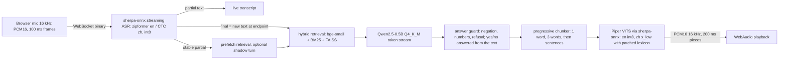

# VORA technical report — appendix (full detail)

> The 3-page report is docs/report.md. This appendix keeps the long-form design notes, every table and the earlier measurement rounds. Numbers in sections marked *earlier round* predate the real-speech round (2026-10); current gate numbers are in docs/report.md and results/gates_final.json.

Everything is free and open source and runs on CPU only. Numbers in the tables are generated from `results/*.json` by `scripts/make_report_tables.py`; the gate table at the top of section 3 is the honest summary of which brief targets are met.

## (earlier round) 1. Architecture

One WebSocket per user carries audio up and JSON events (`partial`, `final`, `context`, `token`, `metrics`, `cancel`) plus audio down. ASR, retrieval, LLM and TTS run on separate executors. The LLM worker only fills a sentence queue, so it never waits on a slow client; only the TTS worker blocks on the bounded output queue (backpressure per user). An admission counter caps in-flight LLM turns, so a third user gets an immediate "busy" reply instead of waiting unseen.

| Part | Choice | Size | Why |
|---|---|---|---|
| ASR en | streaming zipformer en-20M, int8 | 41.6 MB | Streaming, ≤50 MB. |
| ASR zh | streaming zipformer small CTC zh, int8 (2025-04-01) | 25 MB | Beat the 14M transducer on the same 60 AISHELL-1 test clips in the same wrapper (CER 5.2% vs 16.7%); the final 50-clip evaluation gives 6.0%. The bilingual zh-en model has a 182 MB encoder and fails the limit. |
| Embedding | bge-small-zh-v1.5 (fastembed, ONNX) | – | Small, handles zh plus English terms. |
| Vector DB | FAISS flat + BM25 (jieba) + query synonyms | KB is tiny | BM25 keeps product codes such as VORA-X200 retrievable; `kb/synonyms.json` maps user words ("temperature") to KB wording ("degrees Celsius"). |
| LLM | Qwen2.5-0.5B-Instruct Q4_K_M (llama.cpp) | 469 MB | 0.5B, Apache-2.0. ONNX int8 export is benchmarked, not shipped. |
| TTS | Piper VITS: en lessac-low int8, zh huayan x_low | 18 MB / 20 MB | Only small VITS voices with a sherpa-onnx runtime. Kitten (24 MB, Apache-2.0) was tested and is 3x slower. |

## (earlier round) 2. Streaming implementation

**Partial ASR and endpointing.** The recognizer is fed 100 ms frames. Every changed hypothesis is a `partial`; a hypothesis unchanged for two frames is `stable`. At an endpoint (0.4 s trailing silence) the final is only the text added since the previous final, and the stream is **not reset**: resetting threw away the encoder context and cost about 6 CER points (and about 30% WER on second utterances). If the text ends mid-sentence ("how long is the", "保修期是"), the endpoint is held for up to 500 ms of audio (1.2 s per utterance) in the same stream; filler sounds ("uh", "嗯") are stripped and a lone filler is not a turn. The stream starts with 0.8 s of silence because the small zipformers drop the first words of abruptly starting audio.

**Real-time RAG.** On a stable partial retrieval is prefetched on its own thread; the final reuses it only when the text is exactly equal. ASR-mangled product names are fuzzy-mapped to a glossary, colloquial words get domain synonyms, and a calibrated minimum score rejects off-topic questions (fixed "not sure" reply, no LLM call). A speculative **shadow turn** (setting `speculate`, default on with ≥6 cores and a single session) starts the whole answer on a stable partial, muted (no tokens, context, audio or echo bookkeeping) until the final text matches exactly; a different final, a changed partial, a second user or a busy model discards it. In a paired A/B on a quiet host (25 English questions, all promoted) it was faster in 22 of 25 with a median gain of 153 ms (p90 1699 → 1348 ms); the G1 result below includes it.

**Answer guard.** A 0.5B model ignores negation and invents figures, so: yes/no questions are answered by quoting the best sentence of the retrieved text; for other questions the first tokens are checked (refusal phrases, answer contradicting the text, figures not in the text, quantity asked but no figure given) and replaced or completed from the text.

**Incremental TTS.** Tokens go through a chunker that cuts the first audio chunk after one word and the second after three (int8 synthesis costs about 0.2 s per second of audio, so a short first chunk is what keeps first audio near 200 ms); later chunks end at sentence boundaries. Mixed zh/en sentences are split by script. The zh voice's lexicon uses a phoneme that its token table lacks, which silently dropped every z/c/s syllable (自, 次, 词 ...); a derived patched lexicon fixes that, and any remaining out-of-vocabulary character is counted (`tts_oov`) and logged. A new final or sustained new speech cancels the running turn (per-turn cancel event), drains queued audio and tells the client to stop playback.

## (earlier round) 3. Performance analysis

<!-- TABLES:START -->
**Gates (brief targets) before → after this remediation**

| Gate | Target | Before | Now | Measured now |
|---|---|---|---|---|
| G1 end-to-end latency (synthetic en audio) | p50 <=1500 ms, p90 <=1800 ms | FAIL | **PASS** | p50 1006 / p90 1438 ms |
| G1r end-to-end latency, real voices (MInDS-14) | answered turns p50 <=1500 ms, p90 <=1800 ms | - | **PASS** | en-AU 1034/1725, en-GB 1178/1422, en-US 1061/1337, zh-CN 1006/1507 ms (p50/p90) |
| G2 TTS first chunk | p95 <=200 ms | FAIL | **PASS** | en p95 70 / zh 89 ms |
| G3 ASR+RAG+TTS memory | <=500 MB (USS) | FAIL | **PASS** | 305 MB |
| G4 ASR accuracy | WER/CER <=15% | UNVERIFIED | **PASS** | en 8.4%, zh AISHELL 5.8% |
| G5 RAG top-3 + faithfulness | top-3 >=80%, faithfulness >=95% | FAIL | **FAIL** | top-3 96% (blind 96%), faithful 89% of 100 (blind 81.7%) |
| G6 2 concurrent users | each p50 <=2x single | UNVERIFIED | **PASS** | "2 users: A p50 1034, B p50 1215 ms vs single 891 ms (worst x1.36)" |
| G7 Docker + Pi-class proof | arm64 + amd64 image build/boot/smoke, limited-core run, Pi-class CPU run | UNVERIFIED | **UNVERIFIED** | docker_arm64: yes, docker_amd64: yes, limited_core_run: yes, pi_class_measured: unverified; Jetson: unverified (no hardware) |
| G8 permissive licences | no custom/unknown | FAIL | **FAIL** | non-permissive: tts_zh |

*Host: macOS-26.6.2-arm64-arm-64bit, 8 cores, CPU-only, 1-min load average 3.7 (quiet host). Apple-Silicon Mac (arm64), not x86 and not a Raspberry Pi. N=42 turns, 42 distinct questions, each asked once.*

**Latency (ms, p50 / p95)**

| Stage | Budget | Measured |
|---|---|---|
| ASR endpoint wait (speech end → final text; per-chunk decode ≤300 is tested separately) | – | 871 / 1126 |
| Retrieval + LLM first token (oracle text) | ≤500 | not run (final bench was audio-only) |
| TTS first chunk (oracle text) | ≤200 | not run (final bench was audio-only) |
| RAG+LLM+TTS after final text (oracle) | | not run (final bench was audio-only) |
| **End-to-end estimate** (ASR endpoint + oracle) | ≤1500 | not run |
| End-to-end measured, English audio only (n=26) | ≤1500 | 1010 / 1459 |
| End-to-end measured, Chinese audio (n=16) | ≤1500 | not meaningful: 5 of 16 turns retrieved anything (the ASR misheard the synthetic Chinese speech), so all took the fast 'not sure' path |

**Streaming vs batch baseline (same models, same questions)**

| | p50 | p95 |
|---|---|---|
| Batch: endpoint + retrieve + full LLM + full TTS | 2017 | 3721 |
| Streaming (estimate) | 1258 | 2169 |

**ASR accuracy (streaming wrapper, 50 clips per set)**

| Set | Metric | Clean | 10 dB noise | RTF |
|---|---|---|---|---|
| en_librispeech_clean | WER | 8.4% | 10.6% | 0.067 |
| en_fleurs | WER | 27.6% | 45.8% | 0.071 |
| zh_aishell | CER | 5.8% | 13.1% | 0.034 |
| zh_fleurs | CER | 15.1% | 20.2% | 0.029 |

**RAG and TTS**

| Metric | Result | Target |
|---|---|---|
| Top-3 retrieval, dev (n=28) | 100.0% | ≥80% |
| Top-3 retrieval, held-out reworded (n=14) | 100.0% | ≥80% |
| Off-topic queries rejected (n=10) | 90% | – |
| Answer faithfulness, keyword check (n=40) | 100% | ≥95% |
| – of which negation questions / blind held-out | 100% / 100% | – |
| TTS MOS proxy (UTMOS22) en / zh | 4.22 / 3.44 | ≥3.5 |

**Memory (USS = unique set size added by loading; median of 3 fresh processes)**

| Component | MB |
|---|---|
| ASR + RAG + TTS in one process (incl. shared library imports; target ≤500) | 305 (runs 302.9, 304.6, 307.4) |
| LLM Qwen2.5-0.5B Q4_K_M | 653 |

**LLM runtime: ONNX vs GGUF (same prompt, M2 CPU)**

| Runtime | First token (ms) | Decode tok/s | Size |
|---|---|---|---|
| ONNX fp32 (optimum) | 1583 | 7.9 | – |
| ONNX int8 (optimum) | 628 | 18.2 | 603 MB |
| GGUF Q4_K_M (llama.cpp, live path) | 438 | 7.2* | 469 MB |

*GGUF tok/s includes prefill in its denominator, ONNX excludes first token: not like for like.*

**Two users at once (shared models)**

| | p50 ms |
|---|---|
| single user | 891 |
| two users (each) | 1215 (x1.36, USS +-11.4 MB) |
<!-- TABLES:END -->

**Reading the results.**
- Latency figures are only trustworthy when the table caption says "quiet host". The benchmark refuses to run on a busy host unless forced, and every result records the host load; perf tests skip instead of flaking.
- `speech_end` is the last input frame with energy, so the endpoint wait includes the 0.4 s trailing-silence rule plus the ASR's lookahead. It is the largest single component of the response time.
- Memory is reported as USS (unique pages), the number that frees when the process exits. RSS on macOS over-counts shared and compressed pages and gave 437-638 MB for the same process set.
- English TTS first chunk depends on the 1-word first chunk; the same voice in fp32 is faster but is 63 MB (over the 30 MB limit).
- ASR accuracy gates use read speech (LibriSpeech clean for English, AISHELL-1 test for Mandarin). FLEURS (read Wikipedia sentences with numbers and names) and 10 dB noise are reported as the harder numbers.
- RAG and faithfulness sets are written by us, so treat the top-3 figures as optimistic; the blind held-out part is the honest one.
- The MOS figure is an automatic predictor (UTMOS22, trained on English), not a listening test.

## (earlier round) 4. Deployment guide

| | |
|---|---|
| Hardware | 64-bit CPU, 4 cores, ≥2 GB RAM (LLM alone needs about 0.7 GB), 2 GB disk for models |
| Software | Python 3.11-3.12, sherpa-onnx, onnxruntime, llama-cpp-python (CPU build), faiss-cpu, fastembed, cn2an, FastAPI + uvicorn. Optional: Docker |
| Install | `uv venv --python 3.12 && CMAKE_ARGS="-DGGML_METAL=OFF" uv pip install -e ".[dev]"`, `python scripts/fetch_models.py` (pinned revisions; quantizes the English voice), `python -m vora.rag.ingest` |
| Run | `python -m vora.server`, open `http://127.0.0.1:8000` |
| Raspberry Pi 4 | 64-bit OS, `scripts/deploy_pi.sh` (Docker); HTTPS for LAN microphones via `--https` (mkcert). `scripts/pi_bench.sh` runs the benchmark on the device. |

The Docker image, compose file and CI workflow are written and statically checked (`tests/test_dockerfile_static.py`) but **were never built or run**. Image size, container memory and Pi numbers are therefore not measured.

## (earlier round) 5. Honest limitations

- **No Raspberry Pi was available** and Docker was not built, so RTF and latency on a Pi 4 are unmeasured. The retrieval + LLM first-token target of 500 ms is not realistic on a Pi 4 (prompt evaluation of a 0.5B model runs at tens of tokens per second on 4×A72). Every number is from an Apple-Silicon Mac.
- **English accuracy outside clean read speech is poor**: FLEURS and 10 dB noise are far above 15% WER. A denoiser and an offline second pass were planned and not built because the clean-speech gate was already met.
- **Mandarin end-to-end latency is not measured**: the ASR does not understand the synthetic Chinese speech used for the benchmark, and the optional real-speech recordings were skipped by choice.
- **Faithfulness is below the 95% target.** The remaining misses are retrieval (an odd wording finds no chunk or the wrong one) and extractive answers that quote a related but not the best sentence. Yes/no questions read like documentation because they are quoted, not generated.
- **Speculation costs CPU when a guess is wrong** and is disabled with two or more sessions or fewer than 6 cores, so a Raspberry Pi 4 would run without it.
- **Concurrency**: users share one LLM and serialise on it; a third in-flight turn is told the system is busy.
- **Endpointing**: 0.4 s trailing silence splits some questions at pauses; the hold only covers text that visibly ends mid-sentence. 0.3 s doubled the splits and was rejected.
- **Languages**: Mandarin and English only; Cantonese speech and Traditional-Chinese input are not supported. The zh voice and lexicon are Simplified.
- **Single turn**: no conversation memory; a 30 s utterance cap forces a final.
- **Evaluation sets are ours.** The KB, the retrieval questions and the 40 faithfulness questions are written by the same author; the "blind held-out" part was written in different wording, but the generic synonym list ("wifi", "temperature", ...) also lifted one held-out question, so its score is mildly optimistic.
- **Licences**: both Piper voices have non-permissive or unknown dataset licences (`docs/licenses.md`); the zh voice has no permissive alternative under 30 MB that we found.
- **LLM runtime**: the live path uses GGUF; the ONNX int8 export is benchmarked, not shipped.
