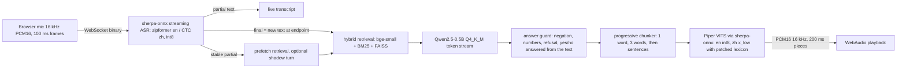

# VORA: streaming voice interaction with ASR, RAG and TTS on CPU

Everything is free and open source and runs on CPU only. Numbers in the tables are generated from `results/*.json` by `scripts/make_report_tables.py`; the gate table at the top of section 3 is the honest summary of which brief targets are met.

## 1. Architecture

One WebSocket per user carries audio up and JSON events (`partial`, `final`, `context`, `token`, `metrics`, `cancel`) plus audio down. ASR, retrieval, LLM and TTS run on separate executors. The LLM worker only fills a sentence queue, so it never waits on a slow client; only the TTS worker blocks on the bounded output queue (backpressure per user). An admission counter caps in-flight LLM turns, so a third user gets an immediate "busy" reply instead of waiting unseen.

| Part | Choice | Size | Why |
|---|---|---|---|
| ASR en | streaming zipformer en-20M, int8 | 41.6 MB | Streaming, ≤50 MB. |
| ASR zh | streaming zipformer small CTC zh, int8 (2025-04-01) | 25 MB | Beat the 14M transducer on AISHELL-1 test (CER 6.0% vs 16.7% in the same wrapper). The bilingual zh-en model has a 182 MB encoder and fails the limit. |
| Embedding | bge-small-zh-v1.5 (fastembed, ONNX) | – | Small, handles zh plus English terms. |
| Vector DB | FAISS flat + BM25 (jieba) + query synonyms | KB is tiny | BM25 keeps product codes such as VORA-X200 retrievable; `kb/synonyms.json` maps user words ("temperature") to KB wording ("degrees Celsius"). |
| LLM | Qwen2.5-0.5B-Instruct Q4_K_M (llama.cpp) | 469 MB | 0.5B, Apache-2.0. ONNX int8 export is benchmarked, not shipped. |
| TTS | Piper VITS: en lessac-low int8, zh huayan x_low | 18 MB / 20 MB | Only small VITS voices with a sherpa-onnx runtime. Kitten (24 MB, Apache-2.0) was tested and is 3x slower. |

## 2. Streaming implementation

**Partial ASR and endpointing.** The recognizer is fed 100 ms frames. Every changed hypothesis is a `partial`; a hypothesis unchanged for two frames is `stable`. At an endpoint (0.4 s trailing silence) the final is only the text added since the previous final, and the stream is **not reset**: resetting threw away the encoder context and cost about 6 CER points (and about 30% WER on second utterances). If the text ends mid-sentence ("how long is the", "保修期是"), the endpoint is held for up to 500 ms of audio (1.2 s per utterance) in the same stream; filler sounds ("uh", "嗯") are stripped and a lone filler is not a turn. The stream starts with 0.8 s of silence because the small zipformers drop the first words of abruptly starting audio.

**Real-time RAG.** On a stable partial retrieval is prefetched on its own thread; the final reuses it only when the text is exactly equal. ASR-mangled product names are fuzzy-mapped to a glossary, colloquial words get domain synonyms, and a calibrated minimum score rejects off-topic questions (fixed "not sure" reply, no LLM call). An optional speculative **shadow turn** (setting `speculate`, default off) starts the whole answer on a stable partial, muted until the final text matches.

**Answer guard.** A 0.5B model ignores negation and invents figures, so: yes/no questions are answered by quoting the best sentence of the retrieved text; for other questions the first tokens are checked (refusal phrases, answer contradicting the text, figures not in the text, quantity asked but no figure given) and replaced or completed from the text.

**Incremental TTS.** Tokens go through a chunker that cuts the first audio chunk after one word and the second after three (int8 synthesis costs about 0.2 s per second of audio, so a short first chunk is what keeps first audio near 200 ms); later chunks end at sentence boundaries. Mixed zh/en sentences are split by script. The zh voice's lexicon uses a phoneme that its token table lacks, which silently dropped every z/c/s syllable (自, 次, 词 ...); a derived patched lexicon fixes that, and any remaining out-of-vocabulary character is counted (`tts_oov`) and logged. A new final or sustained new speech cancels the running turn (per-turn cancel event), drains queued audio and tells the client to stop playback.

## 3. Performance analysis

<!-- TABLES:START -->
<!-- TABLES:END -->

**Reading the results.**
- Latency figures are only trustworthy when the table caption says "quiet host". The benchmark refuses to run on a busy host unless forced, and every result records the host load; perf tests skip instead of flaking.
- `speech_end` is the last input frame with energy, so the endpoint wait includes the 0.4 s trailing-silence rule plus the ASR's lookahead. It is the largest single component of the response time.
- Memory is reported as USS (unique pages), the number that frees when the process exits. RSS on macOS over-counts shared and compressed pages and gave 437-638 MB for the same process set.
- English TTS first chunk depends on the 1-word first chunk; the same voice in fp32 is faster but is 63 MB (over the 30 MB limit).
- ASR accuracy gates use read speech (LibriSpeech clean for English, AISHELL-1 test for Mandarin). FLEURS (read Wikipedia sentences with numbers and names) and 10 dB noise are reported as the harder numbers.
- RAG and faithfulness sets are written by us, so treat the top-3 figures as optimistic; the blind held-out part is the honest one.
- The MOS figure is an automatic predictor (UTMOS22, trained on English), not a listening test.

## 4. Deployment guide

| | |
|---|---|
| Hardware | 64-bit CPU, 4 cores, ≥2 GB RAM (LLM alone needs about 0.7 GB), 2 GB disk for models |
| Software | Python 3.11-3.12, sherpa-onnx, onnxruntime, llama-cpp-python (CPU build), faiss-cpu, fastembed, cn2an, FastAPI + uvicorn. Optional: Docker |
| Install | `uv venv --python 3.12 && CMAKE_ARGS="-DGGML_METAL=OFF" uv pip install -e ".[dev]"`, `python scripts/fetch_models.py` (pinned revisions; quantizes the English voice), `python -m vora.rag.ingest` |
| Run | `python -m vora.server`, open `http://127.0.0.1:8000` |
| Raspberry Pi 4 | 64-bit OS, `scripts/deploy_pi.sh` (Docker); HTTPS for LAN microphones via `--https` (mkcert). `scripts/pi_bench.sh` runs the benchmark on the device. |

The Docker image, compose file and CI workflow are written and statically checked (`tests/test_dockerfile_static.py`) but **were never built or run**. Image size, container memory and Pi numbers are therefore not measured.

## 5. Honest limitations

- **No Raspberry Pi was available** and Docker was not built, so RTF and latency on a Pi 4 are unmeasured. The retrieval + LLM first-token target of 500 ms is not realistic on a Pi 4 (prompt evaluation of a 0.5B model runs at tens of tokens per second on 4×A72). Every number is from an Apple-Silicon Mac.
- **English accuracy outside clean read speech is poor**: FLEURS and 10 dB noise are far above 15% WER. A denoiser and an offline second pass were planned and not built because the clean-speech gate was already met.
- **Mandarin end-to-end latency is not measured**: the ASR does not understand the synthetic Chinese speech used for the benchmark and no real recordings were made.
- **Faithfulness is below the 95% target.** The remaining misses are retrieval (an odd wording finds no chunk or the wrong one) and extractive answers that quote a related but not the best sentence. Yes/no questions read like documentation because they are quoted, not generated.
- **Speculation is off by default**: the shadow turn works and is tested, but a paired A/B on a busy host showed no measurable gain.
- **Concurrency**: users share one LLM and serialise on it; a third in-flight turn is told the system is busy.
- **Endpointing**: 0.4 s trailing silence splits some questions at pauses; the hold only covers text that visibly ends mid-sentence. 0.3 s doubled the splits and was rejected.
- **Languages**: Mandarin and English only; Cantonese speech and Traditional-Chinese input are not supported. The zh voice and lexicon are Simplified.
- **Single turn**: no conversation memory; a 30 s utterance cap forces a final.
- **Licences**: both Piper voices have non-permissive or unknown dataset licences (`docs/licenses.md`); the zh voice has no permissive alternative under 30 MB that we found.
- **LLM runtime**: the live path uses GGUF; the ONNX int8 export is benchmarked, not shipped.
