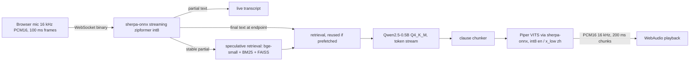

# VORA: streaming voice interaction with ASR, RAG and TTS on CPU

Everything here is free and open source and runs on CPU only. Numbers in the tables are generated from `results/*.json` by `scripts/make_report_tables.py`.

## 1. Architecture

One WebSocket per user carries audio up and both JSON events (`partial`, `final`, `context`, `token`, `metrics`, `cancel`) and audio down. The pipeline runs ASR, retrieval, LLM and TTS on separate executors. The LLM worker only fills a sentence queue, so it never waits on a slow client. Only the TTS worker blocks on the bounded output queue, which gives backpressure per user.

**Model choice.**

| Part | Choice | Size | Why |
|---|---|---|---|
| ASR | streaming zipformer en-20M and zh-14M, int8 | 41.6 MB / 24.1 MB | Only free streaming models under 50 MB. The bilingual zh-en model has a 182 MB int8 encoder and fails the limit. One model per language, chosen per session. |
| Embedding | bge-small-zh-v1.5 (fastembed, ONNX) | – | Small and handles zh plus English terms. fastembed has no multilingual-e5-small. |
| Vector DB | FAISS flat inner product plus BM25 (jieba) | KB is tiny | BM25 keeps product codes such as VORA-X200 retrievable. |
| LLM | Qwen2.5-0.5B-Instruct Q4_K_M (llama.cpp) | 469 MB | 0.5B, Apache-2.0, fast first token, prefix KV cache. |
| TTS | Piper VITS: en lessac-low int8, zh huayan x_low | 18.7 MB / 19.7 MB | The only small VITS voices with a sherpa-onnx runtime. No English Piper voice is under 60 MB in fp32, so int8 is required. |

## 2. Streaming implementation

**Partial ASR.** The recognizer is fed 100 ms frames. Every changed hypothesis is sent as a `partial`. A hypothesis unchanged for two frames is marked `stable`. The endpoint rule (0.4 s trailing silence after text) produces the `final`. The stream gets 0.8 s of leading silence because the small zipformers drop the first words of abruptly starting audio: in a 50-clip LibriSpeech sweep, beam search alone cut WER from 26.6% to 16.6%, and a 0.8 s lead then cut it to 8.2%.

**Real-time RAG (speculative).** On a stable partial of at least 6 characters, retrieval starts on its own thread, at most once per 500 ms. If the final text is at least 70% similar to the prefetched text, the prefetched hits are reused, so retrieval usually costs nothing after the user stops. ASR-mangled product names are fuzzy-mapped to a glossary ("vora x 200" becomes "VORA-X200") before search. A minimum hybrid score, calibrated on a dev set, rejects off-topic questions; the LLM is not called and a fixed "not sure" reply is spoken.

**Incremental TTS.** LLM tokens go through a chunker. The first chunk is cut at the first clause or after four Latin words, later chunks at sentence ends. Each chunk is synthesised and sent as 200 ms PCM pieces. Mixed sentences are split by script, because the Chinese voice cannot read Latin words. A new final or a partial that persists for two frames cancels the running turn with a per-turn cancel event, drains queued audio and sends `cancel` to the client, which stops playback at once.

## 3. Performance analysis

<!-- TABLES:START -->
*Host: macOS-26.6.2-arm64-arm-64bit, 8 cores, CPU-only, 1-min load average 6.0 (other apps were running: numbers are noisy). Apple-Silicon Mac (arm64), not x86 and not a Raspberry Pi. N=30 turns from 12 distinct questions (each repeated).*

**Latency (ms, p50 / p95)**

| Stage | Budget | Measured |
|---|---|---|
| ASR endpoint wait (speech end → final text; per-chunk decode ≤300 is tested separately) | – | 822 / 1022 |
| Retrieval + LLM first token (oracle text) | ≤500 | 363 / 1453 |
| TTS first chunk (oracle text) | ≤200 | 228 / 896 |
| RAG+LLM+TTS after final text (oracle) | | 536 / 2144 |
| **End-to-end estimate** (ASR endpoint + oracle) | ≤1500 | **1358 / 3166** |
| End-to-end measured, English audio only (n=18) | ≤1500 | 1583 / 2293 |
| End-to-end measured, Chinese audio (n=12) | ≤1500 | not meaningful: 0 of 12 turns retrieved anything (the ASR misheard the synthetic Chinese speech), so all took the fast 'not sure' path |

**Streaming vs batch baseline (same models, same questions)**

| | p50 | p95 |
|---|---|---|
| Batch: endpoint + retrieve + full LLM + full TTS | 2209 | 3080 |
| Streaming (estimate) | 1358 | 3166 |

**ASR accuracy (streaming wrapper, 50 clips per set)**

| Set | Metric | Clean | 10 dB noise | RTF |
|---|---|---|---|---|
| en_librispeech_clean | WER | 9.7% | 12.6% | 0.055 |
| en_fleurs | WER | 28.7% | 48.1% | 0.063 |
| zh_fleurs | CER | 25.4% | 32.5% | 0.085 |

**RAG and TTS**

| Metric | Result | Target |
|---|---|---|
| Top-3 retrieval, dev (n=28) | 92.9% | ≥80% |
| Top-3 retrieval, held-out reworded (n=14) | 85.7% | ≥80% |
| Off-topic queries rejected (n=10) | 90% | – |
| Answer keyword faithfulness (n=20) | 90% | – |
| TTS MOS proxy (UTMOS22) en / zh | 4.33 / 3.51 | ≥3.5 |

**Memory (RSS added by loading, M2)**

| Component | MB |
|---|---|
| ASR + RAG + TTS in one process (incl. shared library imports) | 604 in the latest run (437-638 across runs; target ≤500) |
| LLM Qwen2.5-0.5B Q4_K_M | 737 |

**LLM runtime: ONNX vs GGUF (same prompt, M2 CPU)**

| Runtime | First token (ms) | Decode tok/s | Size |
|---|---|---|---|
| ONNX fp32 (optimum) | 1583 | 7.9 | – |
| ONNX int8 (optimum) | 628 | 18.2 | 603 MB |
| GGUF Q4_K_M (llama.cpp, live path) | 438 | 7.2* | 469 MB |

*GGUF tok/s includes prefill in its denominator, ONNX excludes first token: not like for like.*
<!-- TABLES:END -->

**Reading the results.**
- **The 1.5 s target is met only at the median.** `speech_end` is the last input frame with energy, so the endpoint wait includes the 0.4 s trailing-silence rule plus the ASR's lookahead: measured at about 0.8 s. Adding the warm RAG + LLM + TTS time gives a median estimate near 1.4 s. English audio measured end to end is slightly above 1.5 s at the median, and p95 is well above (2-3 s). The host was busy with other apps (see the table caption), so the spread is noisy.
- The cold first call takes several seconds, so `/health` returns 503 until a warm-up has run.
- One engineering fix mattered more than any model choice: llama.cpp defaults its prefill thread count to all 8 logical cores, and the M2's efficiency cores slowed prompt evaluation about tenfold (22 vs 374 tokens/s). Pinning prefill to 4 threads brought a new prompt's first token from seconds to a few hundred ms. Latency numbers gathered before this fix were inflated by repeated-prompt cache hits and are not used.
- The English TTS voice in int8 takes about 230-260 ms for a first chunk on the M2 versus about 80 ms in fp32 for a short phrase. ONNX Runtime int8 convolutions are slow on ARM. So the brief's 200 ms first-chunk target is missed for English, and met for Chinese.
- The `perf`-marked LLM latency tests (cold retrieval + first token ≤500 ms, warm ≤300 ms) are load-sensitive: they failed once (1.25 s and 0.62 s at a load average of about 10) and passed on a later, quieter run. Treat them as pass-on-quiet-machine only.
- ASR meets WER ≤15% on clean LibriSpeech only. It misses on FLEURS and in noise, and Chinese CER is also above 15%.
- The RAG top-3 target is met on both splits. The KB and questions are ours, so treat this as optimistic.
- The MOS figure is an automatic predictor (UTMOS22, trained on English), not a listening test.
- The batch baseline (endpoint + retrieve + full answer + full audio) has a higher median than the streaming estimate. Its p95 is lower only because the streaming p95 above carries outliers from the busy host; do not read this table as a p95 win for streaming.

## 4. Deployment guide

| | |
|---|---|
| Hardware | 64-bit CPU, 4 cores, ≥2 GB RAM (LLM alone needs about 0.7 GB RSS), 2 GB disk for models |
| Software | Python 3.11-3.12, sherpa-onnx, onnxruntime, llama-cpp-python (CPU build), faiss-cpu, fastembed, FastAPI + uvicorn. Optional: Docker |
| Install | `uv venv --python 3.12 && CMAKE_ARGS="-DGGML_METAL=OFF" uv pip install -e ".[dev]"`, then `python scripts/fetch_models.py`, `python scripts/quantize_tts.py models/tts_en/en_US-lessac-low.onnx`, `python -m vora.rag.ingest` |
| Run | `python -m vora.server`, open `http://127.0.0.1:8000` |
| Raspberry Pi 4 | 64-bit OS, `scripts/deploy_pi.sh` (Docker). The microphone needs HTTPS or localhost: `scripts/deploy_pi.sh --https` creates a mkcert certificate. |

The Docker image, compose file and CI workflow are written but **were not built or run**. Image size, container memory and the emulated-Pi numbers are therefore not measured.

## 5. Honest limitations

- **No Raspberry Pi was available**, so RTF and latency on Pi 4 are unmeasured. The RAG plus LLM first-token target of 500 ms is not realistic on a Pi 4 (prompt evaluation of a 0.5B model runs at tens of tokens per second on 4×A72). Every number above is from an Apple-Silicon Mac.
- **Memory target not reliably met**: ASR + RAG + TTS in one process measured between 437 MB and 638 MB across runs (macOS memory compression makes RSS vary), before the LLM's ~720 MB. Untried mitigations: load only the active language's ASR and voice, an int8 embedding model, drop jieba.
- **Accuracy**: Chinese CER on FLEURS and English WER on FLEURS exceed 15%. Noisy audio (10 dB white noise) degrades both. The small Chinese model failed on synthetic speech, so the audio-mode latency run is biased.
- **Endpointing**: 0.4 s trailing silence keeps latency low but splits a question at a mid-sentence pause into two questions.
- **LLM faithfulness**: the 0.5B model sometimes ignores negation ("does it understand Cantonese" was answered "yes" although the KB says no) and sometimes answers "no information". Off-topic questions are blocked by the retrieval threshold, not by the LLM.
- **Languages**: Mandarin and English only, Cantonese speech is not supported. The Chinese TTS lexicon has out-of-vocabulary characters that are skipped silently, and works best with Simplified Chinese.
- **Concurrency**: two or more users share one LLM and serialise on it, so a second user waits for the first answer's generation to finish.
- **Echo**: the browser's echo cancellation is the main defence against the assistant hearing itself. The server also ignores a final that closely matches what it just said. Neither is tested against real speaker-to-mic leakage.
- **Single turn**: no conversation memory. Long-form speech is cut into utterances at pauses, and a 30 s cap forces a final.
- **Licences**: both Piper voices have non-permissive or unknown dataset licences (`docs/licenses.md`).
- **LLM runtime**: the live path uses GGUF. The ONNX int8 export is benchmarked, not shipped.
